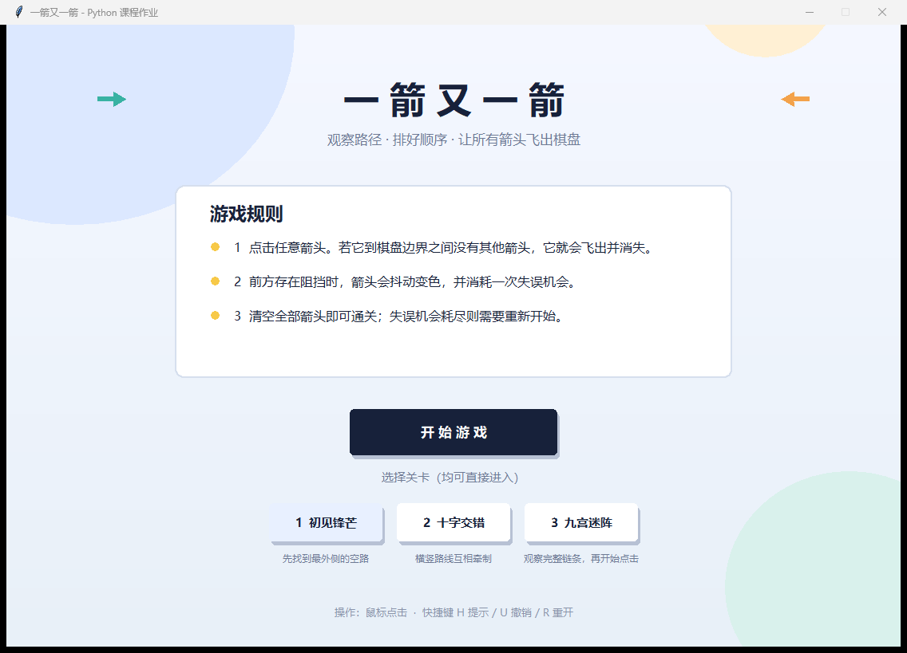
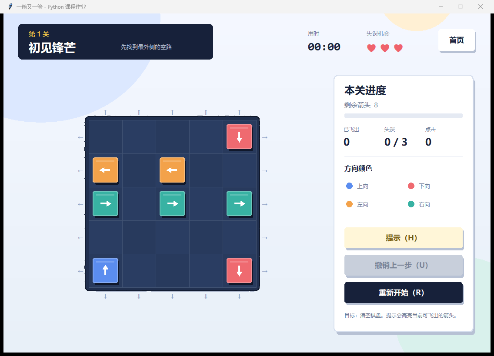
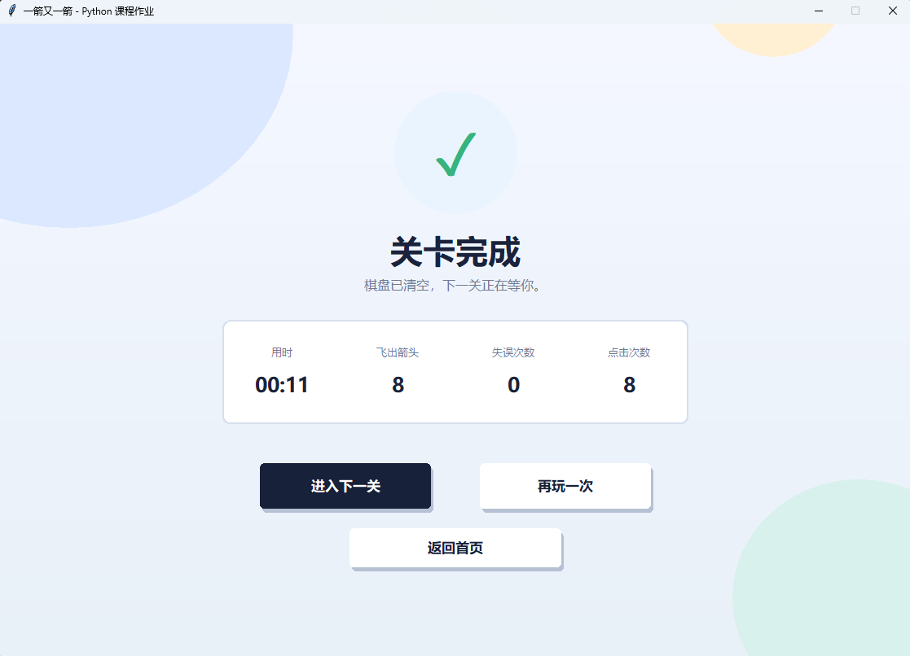
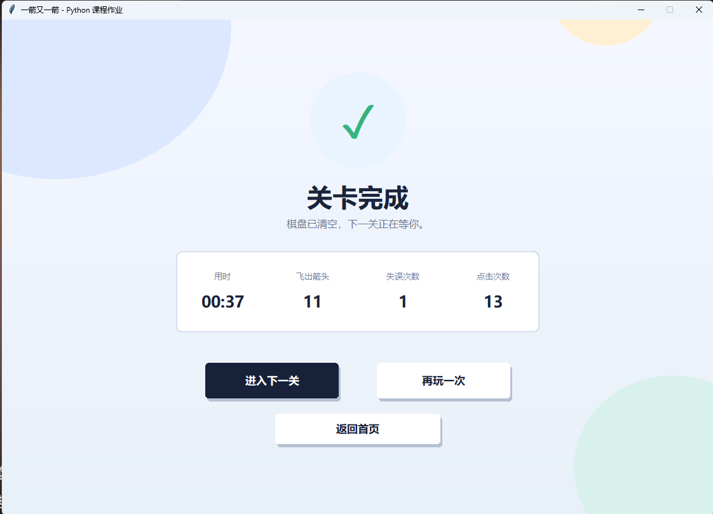
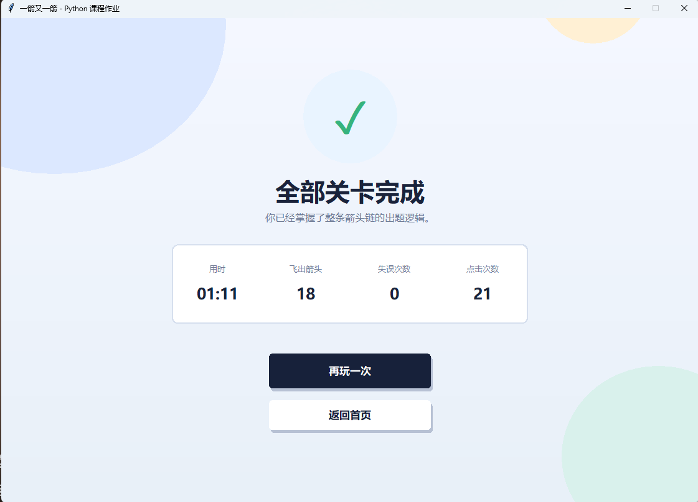
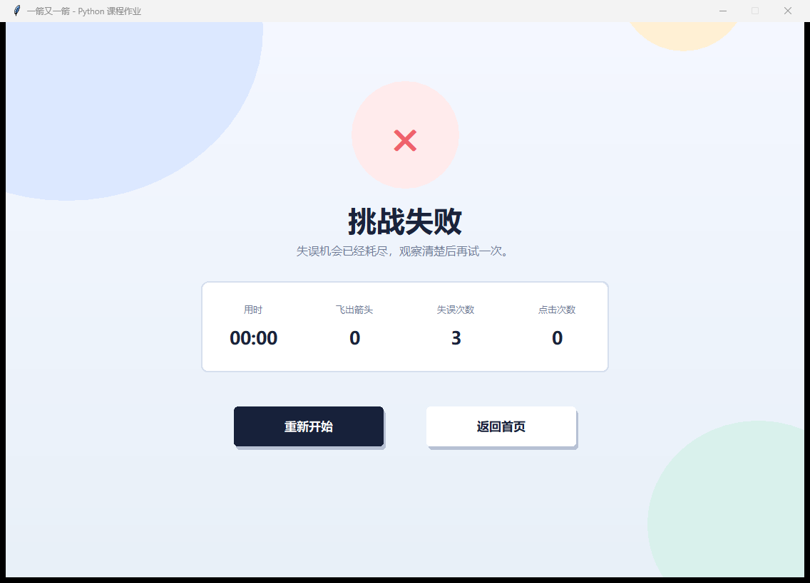

# 一箭又一箭

一个使用 **Python + Tkinter** 独立开发的点击式箭头解谜小游戏。玩家需要观察箭头方向与彼此之间的阻挡关系，按正确顺序点击箭头，让它们逐一飞出棋盘。

> 本项目为《软件工程》课程第二次个人作业，参考“一箭又一箭”的核心基础玩法重新设计并实现，没有使用原游戏的素材、代码或关卡。

## 游戏截图













## 游戏简介

- 棋盘由网格组成，每个箭头占据一个格子。
- 箭头方向分为上、下、左、右四种。
- 点击箭头后会检查它与棋盘边界之间是否还有其他箭头。
- 路径无阻挡：箭头播放飞出动画并从棋盘消失。
- 路径有阻挡：箭头抖动、变红，并消耗一次失误机会。
- 清空全部箭头即可通关；失误机会耗尽则挑战失败。
- 内置 3 个关卡，并与自动求解器一起验证了可通关顺序。
- 附加功能：提示、撤销上一步、计时、点击统计、关卡自选。

## 开发环境

| 项目 | 版本/说明 |
| --- | --- |
| 操作系统 | Windows 10/11 |
| Python | 3.10 及以上，开发验证版本为 3.13.9 |
| 图形库 | Tkinter 8.6（Python 标准库自带） |
| 第三方依赖 | 无 |
| 编辑器/AIGC | Codex 辅助开发 |

## 安装与运行

1. 安装 Python 3.10 或更高版本。安装时建议勾选 `Add Python to PATH`。
2. 确认 Tkinter 可用：

```powershell
python -m tkinter
```

3. 进入项目目录并启动游戏：

```powershell
python main.py
```

项目不依赖第三方包，因此不需要执行 `pip install`。

Windows 用户也可以双击 `run_game.bat` 启动。

## 游戏操作

| 操作 | 说明 |
| --- | --- |
| 鼠标左键 | 点击箭头 |
| `H` | 显示提示，高亮当前可飞出的箭头 |
| `U` | 撤销上一次成功飞出的箭头 |
| `R` | 重新开始当前关卡 |
| `Esc` | 返回开始界面 |

## 实现思路

### 1. 箭头与方向

每个箭头由 `(row, col, direction)` 表示：

- `row`、`col`：箭头在棋盘中的行列坐标；
- `direction`：`U`、`D`、`L`、`R` 四种方向之一。

### 2. 路径检测

检查箭头能否飞出时，从箭头所在格开始，沿着对应方向逐格前进，直到棋盘边界：

- 如果遇到另一个箭头，说明路径被阻挡；
- 如果顺利到达边界，说明箭头可以飞出。

该逻辑位于 `arrow_game/core.py`，与界面代码分离，便于单元测试。

### 3. 关卡数据与自动验证

关卡数据位于 `arrow_game/levels.py`。`LevelState.solve()` 使用带回溯搜索和状态记忆的求解器寻找任意通关顺序。自动化测试会再次按照求解顺序操作，确保三个关卡都确实可以通关。

### 4. 动画与反馈

Tkinter Canvas 负责绘制开始、游戏、通关和失败界面。箭头飞出采用缓出动画；阻挡采用正弦抖动和红色闪烁；状态栏实时显示当前关卡、剩余箭头、失误次数、时间与点击次数。

## 项目结构

```text
.
├── main.py                    # 程序入口
├── run_game.bat               # Windows 一键启动
├── arrow_game/
│   ├── __init__.py
│   ├── app.py                 # Tkinter 图形界面
│   ├── core.py                # 路径检测、状态和求解器
│   └── levels.py              # 三个关卡的数据
├── tests/
│   └── test_game.py           # T01-T06 自动化测试
├── docs/
│   ├── AIGC使用记录.md
│   ├── 博客草稿.md
│   ├── 测试报告.md
│   ├── PSP.md
│   └── screenshots/           # 游戏截图
└── README.md
```

## 测试

运行全部自动化测试：

```powershell
python -m unittest discover -s tests -v
```

测试覆盖：

| 编号 | 测试内容 | 预期结果 |
| --- | --- | --- |
| T01 | 点击前方无阻挡的箭头 | 箭头飞出并消失 |
| T02 | 点击前方有阻挡的箭头 | 箭头不消失，失误次数减 1 |
| T03 | 点击边缘且朝向棋盘外的箭头 | 正常消失，无越界错误 |
| T04 | 清空全部箭头 | 进入通关状态 |
| T05 | 失误次数耗尽 | 进入失败状态 |
| T06 | 游戏过程中重新开始 | 布局和失误次数恢复 |

## AIGC 使用说明

开发过程使用了 Codex 辅助完成需求拆解、核心逻辑、界面实现、关卡验证和测试设计。较真实、较完整的过程记录见 [AIGC使用记录.md](docs/AIGC使用记录.md)。

提交前请本人至少实际试玩一次，并在记录中补充自己真实进行过的检查或修改，不要虚构使用过程。

## 博客与 PSP

博客初稿见 [博客草稿.md](docs/博客草稿.md)，PSP 表见 [PSP.md](docs/PSP.md)。其中学号、课程链接和作业链接仍需提交者填写。

## GitHub 仓库

当前仓库：https://github.com/Feion-Chen/2601-fzu-SoftwareEngineering-YuezhongWu

本项目目录：`homework/single/task2/arrow-game`。

仓库需要至少包含：

- 程序源代码；
- `README.md`；
- 运行所需的资源文件；
- 多次有意义的 Commit。

当前项目可通过以下命令初始化并提交：

```powershell
git init
git add .
git commit -m "feat: 完成箭头棋盘和基础界面"
```

克隆或下载后，按照“安装与运行”步骤即可运行。


